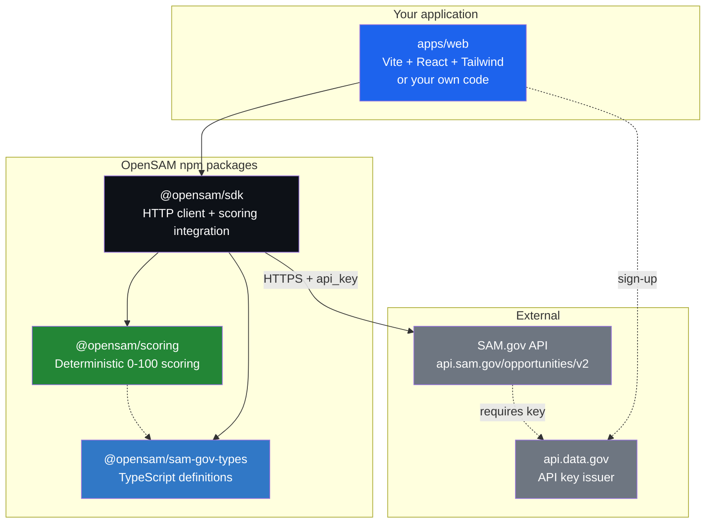
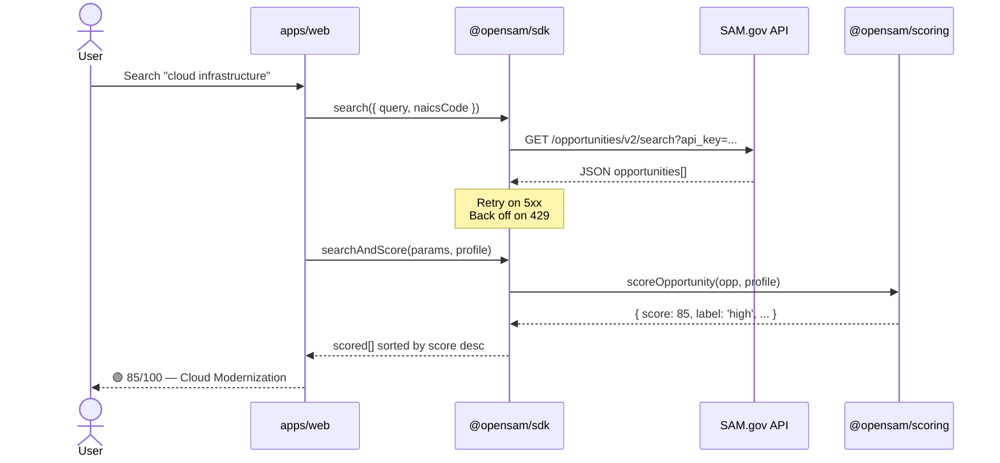
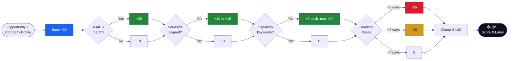
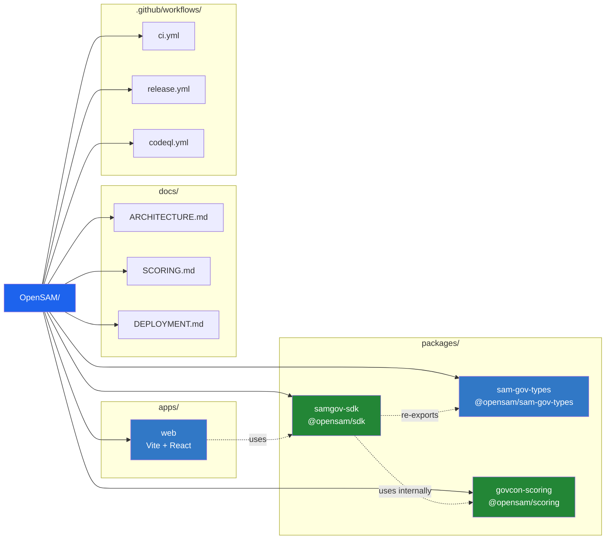

<div align="center">

# OpenSAM

**Open-source autonomous agent platform for SAM.gov federal contracting.**

Type-safe SDK · Viability scoring engine · Web application · No vendor lock-in

[](https://github.com/eddyflores100-lang/OpenSAM/actions/workflows/ci.yml)
[](https://github.com/eddyflores100-lang/OpenSAM/actions/workflows/codeql.yml)
[](https://www.typescriptlang.org/)
[](LICENSE)
[](https://nodejs.org/)
[](#packages)

**Live:** [opensam.us](https://opensam.us) · **Code:** [github.com/eddyflores100-lang/OpenSAM](https://github.com/eddyflores100-lang/OpenSAM)

Built by [AliceLabs LLC](https://alicelabs.site)

</div>

---

## What is OpenSAM?

OpenSAM is an open-source toolkit that helps small businesses, contractors, and AI agents **find, filter, score, and act on federal contracting opportunities published on SAM.gov** — without paying for a proprietary feed or relying on closed models.

It is composed of three independent npm packages, a web application, and an opinionated monorepo structure that you can fork, customize, and ship under the MIT license.

| Layer | Package | What it does |
|---|---|---|
| 🧩 Types | `@opensam/sam-gov-types` | TypeScript definitions for every endpoint of the SAM.gov Public API |
| 🔌 SDK | `@opensam/sdk` | HTTP client with retries, rate-limit handling, pagination, and built-in scoring |
| 📊 Scoring | `@opensam/scoring` | Deterministic viability scoring (0–100) — NAICS, set-aside, capabilities, deadline |
| 🌐 Web app | `apps/web` | Reference front-end (Vite + React + Tailwind) showing search + scoring in action |

All packages are **zero-runtime-dependency** (only `devDependencies` for build/test). The SDK runs on Node 18+, browsers, and edge runtimes.

---

## Why?

The federal government publishes thousands of contracting opportunities every week on [SAM.gov](https://sam.gov). Reading them manually is impractical. Existing commercial tools charge $200–$2,000/month and lock you into their UX, their scoring, and their AI providers.

OpenSAM exists because:

1. **Public data should be accessible in code, not just behind a paywall UI.**
2. **Scoring should be transparent and auditable, not a black box.** The formula is in [`packages/govcon-scoring/src/index.ts`](packages/govcon-scoring/src/index.ts) — 119 lines, fully documented.
3. **AI agents need a typed interface** to reason about opportunities, not scraped HTML. This is what `@opensam/sdk` provides.
4. **Small businesses** (8(a), HUBZone, WOSB, SDVOSB) deserve a free tool to find their best-fit contracts before their competitors do.

---

## Architecture



## Data flow



## How scoring works

The viability score is a deterministic, transparent 0–100 number. No AI credits, no opaque weights.



| Factor | Points | Logic |
|---|---|---|
| **Base** | 50 | Starting point for every opportunity |
| **NAICS match** | +25 | Opportunity's primary NAICS is in your profile |
| **Set-aside eligibility** | +10 to +15 | Your certifications align with the set-aside type |
| **Capability keywords** | +5 each (max +20) | Your capabilities appear in the opportunity description |
| **Deadline proximity** | −15 to −35 | Penalty if the response deadline is within 7 days |

Final score is clamped to 0–100 and labeled:

- 🟢 **high** — 70 or above (bid this)
- 🟡 **medium** — 40–69 (worth reviewing)
- 🔴 **low** — below 40 (probably skip)

See the full source: [`packages/govcon-scoring/src/index.ts`](packages/govcon-scoring/src/index.ts) and [`docs/SCORING.md`](docs/SCORING.md).

---

## Quick start

### 1. Get a free SAM.gov API key

- Sign up at https://api.data.gov/signup/ (free, takes 30 seconds).
- Your key works for the SAM.gov Opportunities Public API immediately.

### 2. Install the SDK

```bash
npm install @opensam/sdk
```

### 3. Search and score opportunities

```typescript
import { createClient } from '@opensam/sdk'

const sam = createClient({
  apiKey: process.env.SAM_GOV_API_KEY!, // from api.data.gov
})

// Search for active cloud-infrastructure solicitations
const results = await sam.search({
  query: 'cloud infrastructure',
  naicsCode: '541512',
  noticeType: 'Solicitation',
  activeOnly: true,
  limit: 25,
})

console.log(`Found ${results.total} matching opportunities`)

// Score each one against your company profile
const scored = await sam.searchAndScore(results.params, {
  naicsCodes: ['541511', '541512', '541519'],
  capabilities: ['software development', 'cloud infrastructure', 'react', 'node.js'],
  certifications: ['Small Business', 'SBA 8(a)'],
})

scored.forEach(({ opportunity, score, label }) => {
  console.log(`[${label.toUpperCase()} ${score}/100] ${opportunity.title}`)
})
```

### 4. Or use the scoring engine standalone

If you already fetch opportunities elsewhere and just want the scoring:

```bash
npm install @opensam/scoring
```

```typescript
import { scoreOpportunity } from '@opensam/scoring'

const score = scoreOpportunity(
  {
    naicsCode: '541512',
    setAside: '8(a) Competitive',
    description: 'Cloud infrastructure modernization and software development',
    responseDeadline: '2026-05-01T17:00:00Z',
  },
  {
    name: 'Acme Federal LLC',
    naicsCodes: ['541511', '541512', '541519'],
    capabilities: ['software development', 'cloud infrastructure'],
    certifications: ['Small Business', 'SBA 8(a)'],
  },
)
// → 85 (out of 100)
```

---

## Monorepo structure



```
OpenSAM/
├── packages/
│   ├── sam-gov-types/      # TypeScript definitions
│   ├── samgov-sdk/         # HTTP client + scoring integration
│   └── govcon-scoring/     # Standalone scoring engine
├── apps/
│   └── web/                # Reference Vite + React web app
├── docs/
│   ├── ARCHITECTURE.md
│   ├── SCORING.md
│   └── DEPLOYMENT.md
├── examples/
│   └── basic-search.ts
├── .github/workflows/
│   ├── ci.yml              # Type-check, test, build (Node 18/20/22)
│   └── release.yml         # npm publish + GitHub Release on tag
├── package.json            # npm workspaces root
└── tsconfig.base.json
```

Each package is independently versionable and publishable. The web app depends on the SDK via `workspace:*`-style resolution.

---

## Release lifecycle


Releases are automated via GitHub Actions:

1. A maintainer pushes a tag `v1.2.3` to `main`.
2. The `release.yml` workflow builds, tests, and publishes each package to npm.
3. A GitHub Release is auto-created with generated release notes.

---

## Development

### Prerequisites

- Node.js 18+ (recommended: 20 LTS)
- npm 9+ (bundled with Node 20)

### Install dependencies

```bash
git clone https://github.com/eddyflores100-lang/OpenSAM.git
cd OpenSAM
npm install
```

### Run tests

```bash
npm test          # all packages
npm run typecheck # tsc --noEmit across the monorepo
npm run build     # build all packages
```

### Run the web app locally

```bash
npm run dev
# opens http://localhost:5173
```

You'll need a `.env.local` in `apps/web/`:

```bash
VITE_SAM_GOV_API_KEY=your_api_data_gov_key
```

---

## Roadmap

- [x] Type definitions for SAM.gov Opportunities API
- [x] HTTP client with retries, rate-limit handling, async iteration
- [x] Deterministic viability scoring (NAICS + set-aside + capabilities + deadline)
- [x] Web app with search + scoring UI
- [x] CI/CD pipeline (Node 18/20/22, CodeQL, npm publish on tag)
- [ ] Multi-user Supabase backend with RLS and encrypted PII
- [ ] Edge Functions for automated daily opportunity digest
- [ ] LLM agent that drafts proposal responses from opportunity + profile
- [ ] Integrations with SAM.gov Entity, FPDS, USAspending
- [ ] CLI tool: `npx opensam search "cloud infrastructure" --score`

Have an idea? Open a [discussion](https://github.com/eddyflores100-lang/OpenSAM/discussions).

---

## Legal & data sources

- All opportunity data comes from the [SAM.gov Opportunities Public API](https://open.gsa.gov/api/get-opportunities-public-api/), operated by the U.S. General Services Administration (GSA).
- OpenSAM is **not affiliated with, endorsed by, or sponsored by** the U.S. Government or GSA.
- All code in this repository is licensed under the [MIT License](LICENSE) © AliceLabs LLC.
- See [`LEGAL.md`](LEGAL.md) for full disclaimers.

---

## Security

If you discover a security vulnerability, please follow the responsible disclosure process in [`SECURITY.md`](SECURITY.md). Do **not** open a public issue.

---

## Contributing

Pull requests are welcome. Please read [`CONTRIBUTING.md`](CONTRIBUTING.md) first, and make sure your code passes `npm test` and `npm run typecheck` before submitting.

By contributing, you agree that your contributions will be licensed under the MIT License.

---

## License (Dual)

OpenSAM uses a **dual license** model:

| Component | License | What it means |
|-----------|---------|---------------|
| `@opensam/sdk` | [MIT](packages/samgov-sdk/LICENSE) | Use, modify, sell — no restrictions |
| `@opensam/scoring` | [MIT](packages/govcon-scoring/LICENSE) | Use, modify, sell — no restrictions |
| `@opensam/sam-gov-types` | [MIT](packages/sam-gov-types/LICENSE) | Use, modify, sell — no restrictions |
| Web app + landing page | [AL-1.0](apps/LICENSE-AL-1.0) | Proprietary — no copying, no redistribution |

This is **open-core**: the developer tools are free and open-source under MIT; the hosted platform is proprietary under AliceLabs Proprietary License (AL-1.0).

© 2026 AliceLabs LLC
