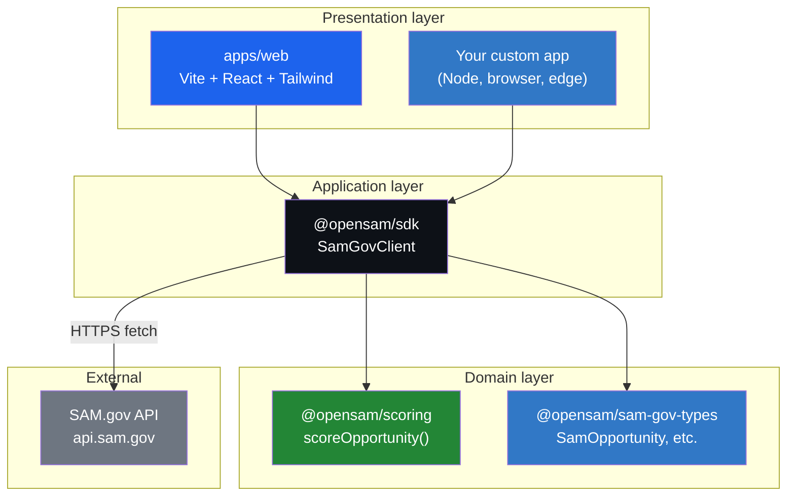
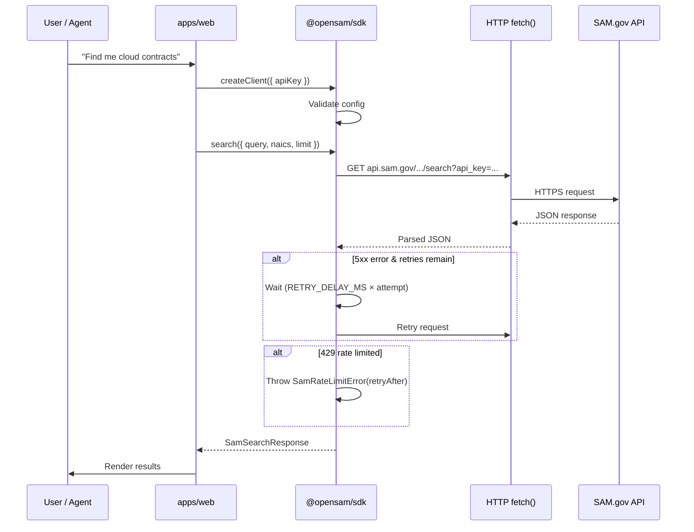
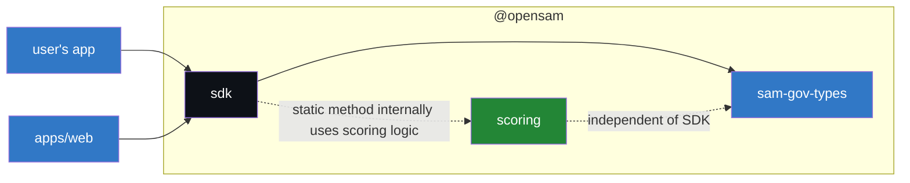
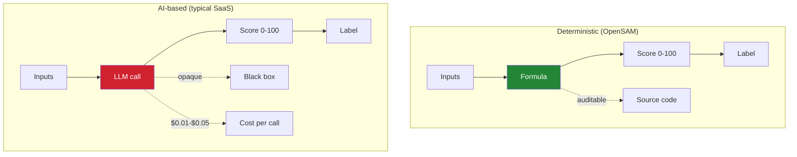

# Architecture

This document describes the high-level architecture of OpenSAM.

## Design principles

1. **Composable, not monolithic.** Each layer (types, SDK, scoring, web) is an independent npm package. Use only what you need.
2. **Zero runtime dependencies.** Published packages depend on nothing at runtime. Less supply-chain risk, smaller installs, faster cold starts on edge runtimes.
3. **Strict TypeScript.** `strict: true` everywhere. The types ARE the contract.
4. **Transparent scoring.** The scoring formula is in plain text in `packages/govcon-scoring/src/index.ts`. No black boxes, no AI credits required to reproduce a score.
5. **Public data only.** OpenSAM never asks for or stores your SAM.gov credentials. The API key is yours and stays on your infrastructure.

## Layered architecture

## Request lifecycle

## Package dependency graph

Each package is independently published to npm and has **no runtime dependency** on the others. You can `npm install @opensam/scoring` without ever touching the SDK.

## Why a monorepo?

The three packages share types and concepts. Keeping them in one repo means:

- A breaking change in `sam-gov-types` can be coordinated with a fix in `samgov-sdk` in the same PR.
- Tests can verify cross-package interactions.
- Release notes can be generated across the whole stack.

But each package is independently published to npm and has no runtime dependency on the others. You can `npm install @opensam/scoring` without ever touching the SDK.

## Why zero-dependency?

A `package.json` with zero `dependencies`:

- Installs in milliseconds.
- Cannot break when a transitive dependency publishes a malicious version.
- Works in browsers, Node, Bun, Deno, Cloudflare Workers, Vercel Edge, and any environment that speaks HTTPS and `fetch`.

The cost: the SDK uses `fetch` directly, which means it requires Node 18+ (when `fetch` became built-in) or a browser.

## Why deterministic scoring (not AI)?

AI-based scoring is:

- **Expensive** — every API call costs money.
- **Non-reproducible** — the same input may produce different scores across runs.
- **Opaque** — you can't audit why a score is 73 instead of 67.
- **Hard to defend** — if a small business asks why they were told to skip an opportunity, "the AI said so" is not a satisfactory answer.

Deterministic scoring is:

- **Free** — runs in microseconds, no API calls.
- **Reproducible** — same input always produces the same score.
- **Auditable** — the formula is 119 lines of TypeScript.
- **Improvable** — if a factor is wrong, you can open a PR and fix it.

AI is great for downstream tasks (drafting proposals, summarizing requirements). Scoring is not one of them.

## What about the web app?

The `apps/web` reference app is a Vite + React + Tailwind SPA that demonstrates how to wire the SDK into a real UI. It also includes:

- Supabase for auth and persistence (optional)
- Row-Level Security policies for multi-tenant isolation
- pgcrypto for PII encryption at rest
- Edge Functions for daily opportunity digests

You're free to fork it, replace Supabase with another backend, or build your own UI from scratch using just the SDK.

## Future work

- Entity API (UEI lookups, contractor profiles)
- FPDS contract award history
- USAspending.gov cross-referencing
- AI agent for proposal drafting (separate package, optional)
- CLI tool `npx opensam ...`
