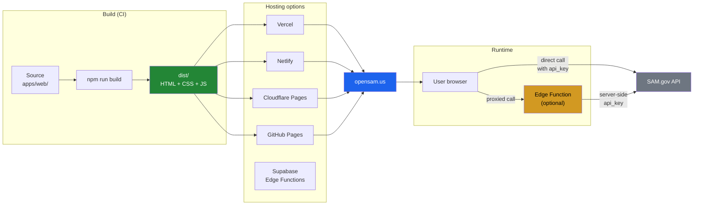

# Deployment

OpenSAM's web app (`apps/web`) is a static Vite build. You can deploy it to any static-hosting provider.

## Deployment topology



## Prerequisites

- A [api.data.gov](https://api.data.gov/signup/) API key (free).
- Optional: a Supabase project if you want multi-user auth and saved searches.

## Build the web app

```bash
cd apps/web
npm install
npm run build   # outputs to dist/
```

## Provider-specific guides

### Vercel

1. Import the repository into Vercel.
2. Set the root directory to `apps/web`.
3. Build command: `npm run build`.
4. Output directory: `dist`.
5. Add environment variable `VITE_SAM_GOV_API_KEY` (or use a serverless function to proxy the API key, so it's not exposed to the browser).
6. Deploy.

### Netlify

1. Connect the repository.
2. Base directory: `apps/web`.
3. Build command: `npm run build`.
4. Publish directory: `apps/web/dist`.
5. Add environment variable `VITE_SAM_GOV_API_KEY`.
6. Deploy.

### Cloudflare Pages

1. Create a new Pages project from the repository.
2. Build command: `npm run build`.
3. Build output directory: `apps/web/dist`.
4. Add environment variable `VITE_SAM_GOV_API_KEY`.
5. Deploy.

### GitHub Pages

1. Add a workflow that builds `apps/web` and publishes to `gh-pages` branch.
2. Enable GitHub Pages in repository settings → Pages → Source: `gh-pages` branch, `/` root.
3. Note: GitHub Pages serves static files only; the SAM.gov API key will be exposed in the browser bundle. For production, use a serverless proxy.

## Securing your API key

For local development, putting `VITE_SAM_GOV_API_KEY` in `.env.local` is fine. For production, **do not** ship the key in the browser bundle — anyone can extract it.

Instead, run a small serverless function that proxies requests to SAM.gov with the key server-side. Example patterns:

- Vercel Edge Function (`apps/web/api/sam.ts`)
- Netlify Edge Function
- Cloudflare Worker
- Supabase Edge Function (the reference app uses this approach)

The reference app's Supabase Edge Functions are included in `apps/web/supabase/functions/`.

## Supabase setup (for multi-user features)

If you want auth, saved searches, and encrypted PII:

1. Create a new project at https://supabase.com.
2. Run the migrations in `apps/web/supabase/migrations/` against your project.
3. Enable Row-Level Security (the migrations already include RLS policies).
4. Set the following environment variables:

   ```
   VITE_SUPABASE_URL=https://your-project.supabase.co
   VITE_SUPABASE_ANON_KEY=your-anon-key
   ```

5. For server-side encryption of PII, the migrations use `pgcrypto`. Make sure the `pgcrypto` extension is enabled (it's on by default in newer Supabase projects).

## Updating the API key

Rotate your api.data.gov key quarterly:

1. Sign in at https://api.data.gov/signup/.
2. Generate a new key.
3. Update your environment variable(s) on your hosting provider.
4. Redeploy.
5. Verify the old key returns 403 (it should be auto-revoked).

## Monitoring

- **Uptime:** use UptimeRobot or Better Stack to ping your deployed app every 5 minutes.
- **API errors:** SAM.gov occasionally returns 503 during maintenance. The SDK retries up to 3 times by default; tune via `createClient({ retries: 5 })`.
- **Rate limits:** api.data.gov enforces 1,000 requests/hour per key for the SAM.gov Opportunities API. If you exceed this, you'll get HTTP 429. The SDK handles this by throwing `SamRateLimitError` with the `retryAfter` value.
