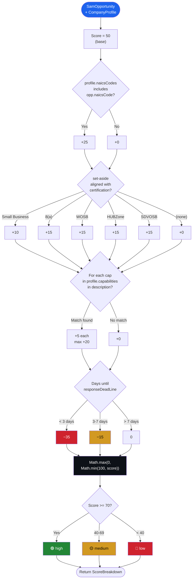

# Scoring methodology

This document explains exactly how OpenSAM computes a viability score for a federal contract opportunity.

## TL;DR

The score is a number between **0 and 100**, computed deterministically from four factors:

| Factor | Range | Effect |
|---|---|---|
| Base | +50 | Starting point for every opportunity |
| NAICS match | 0 or +25 | Your primary NAICS code matches the opportunity |
| Set-aside alignment | 0, +10, or +15 | Your certifications align with the set-aside type |
| Capability keywords | 0 to +20 | Your capabilities appear in the description |
| Deadline proximity | 0, −15, or −35 | Penalty for opportunities closing soon |

Final score is clamped to 0–100 and labeled `high` (≥70), `medium` (40–69), or `low` (<40).

## Score computation flow



## Why this formula?

The formula was designed to be:

1. **Transparent** — anyone can read the 119 lines of source code and reproduce the score.
2. **Deterministic** — same input always produces the same score.
3. **Auditable** — every point added or subtracted is visible in the breakdown.
4. **Free** — no API calls, no AI credits, runs in microseconds.

It is **not** designed to be:

- A prediction of award probability.
- A substitute for human judgment on whether to bid.
- A replacement for reading the full solicitation.

## Factor 1: NAICS match (+25)

The North American Industry Classification System (NAICS) code is the canonical classifier for what an opportunity is about. The opportunity's primary NAICS code is compared against your company profile's `naicsCodes` array.

```typescript
if (profile.naicsCodes.includes(opp.naicsCode)) {
  score += 25
}
```

Why 25? A NAICS match is the strongest signal that your company does the kind of work the agency is looking for. It's worth roughly a quarter of the total score.

## Factor 2: Set-aside alignment (+10 to +15)

Federal opportunities are often set aside for specific socioeconomic categories. If your company holds the matching certification, you're eligible to bid; otherwise you're not.

| Set-aside type | Points | Required certification |
|---|---|---|
| `Total Small Business` / `Small Business` | +10 | Any certification (you must be a small business) |
| `8(a) Competitive` / `8(a) Sole Source` / `SBA Certified 8(a)` | +15 | `SBA 8(a)` |
| `HUBZone` | +15 | `HUBZone` |
| `Women-Owned Small Business` / `Economically Disadvantaged WOSB` | +15 | `WOSB` |
| `Service-Disabled Veteran-Owned Small Business` | +15 | `SDVOSB` |
| (none specified) | 0 | — |

```typescript
if (aside.includes('Small Business') && certs.length > 0) certMatch = 10
if (aside.includes('8(a)') && certs.includes('sba 8(a)')) certMatch = 15
if (aside.includes('Women') && certs.includes('wosb')) certMatch = 15
if (aside.includes('HUBZone') && certs.includes('hubzone')) certMatch = 15
if (aside.includes('Service-Disabled') && certs.includes('sdvosb')) certMatch = 15
```

Note: certifications in your profile should be lowercase (the SDK normalizes them).

## Factor 3: Capability keywords (0 to +20)

Your company profile lists `capabilities` — short phrases describing what your team can do. The scoring engine checks whether each capability appears in the opportunity's free-text `description` field.

```typescript
for (const cap of profile.capabilities) {
  if (opp.description.toLowerCase().includes(cap.toLowerCase())) {
    matchedCapabilities.push(cap)
  }
}
score += Math.min(matchedCapabilities.length * 5, 20)
```

- Each matched capability: +5 points.
- Maximum: +20 (4 matches).

The cap exists because a description that mentions 10 of your capabilities isn't 10× better than one that mentions 4. It's just a longer description.

**Tip:** Use short, common phrases for capabilities (`react`, `node.js`, `cloud infrastructure`) rather than long-tail descriptions (`react 18 with typescript and material ui`).

## Factor 4: Deadline proximity (0, −15, or −35)

Federal opportunities have a hard response deadline. Submitting a competitive proposal takes time, so opportunities closing soon are penalized.

```typescript
const daysLeft = (new Date(opp.responseDeadLine).getTime() - Date.now()) / 86_400_000

if (daysLeft < 3) {
  deadlinePenalty = -35   // < 3 days: almost certainly too late
} else if (daysLeft < 7) {
  deadlinePenalty = -15   // < 1 week: very tight
}
// 7+ days: no penalty
```

Why the asymmetry? A 3-day deadline almost guarantees a rushed, non-competitive proposal. A 7-day deadline is painful but doable for an established team. Anything beyond a week is "comfortable" and gets no penalty.

## Worked example

Company profile:

```typescript
{
  name: 'Acme Federal LLC',
  naicsCodes: ['541511', '541512', '541519'],
  capabilities: ['software development', 'cloud infrastructure', 'react', 'node.js'],
  certifications: ['Small Business', 'SBA 8(a)'],
}
```

Opportunity:

```typescript
{
  naicsCode: '541512',
  setAside: '8(a) Competitive',
  description: 'Cloud infrastructure modernization with react and node.js',
  responseDeadLine: '2026-05-01T17:00:00Z',   // 60 days from now
}
```

Score computation:

| Step | Calculation | Running total |
|---|---|---|
| Base | +50 | 50 |
| NAICS match | +25 (541512 is in profile) | 75 |
| Set-aside | +15 (8(a) Competitive, cert held) | 90 |
| Capabilities | +20 (4 matches: cloud infrastructure, react, node.js — wait, "software development" not in description) → 3 matches × 5 = 15 | 105 |
| Clamp | 105 > 100 → 100 | **100** |
| Deadline | 60 days out → no penalty | **100** |
| Label | score ≥ 70 → `high` | 🟢 **high** |

(Note: "software development" is not in the example description, so only 3 capabilities match: `cloud infrastructure`, `react`, `node.js` — that's +15, not +20. Final score: 90, still `high`.)

## Limitations

This scoring engine does not consider:

- **Past performance** on similar contracts (no public dataset for this).
- **Agency preferences** (some agencies favor incumbents or specific socioeconomic categories beyond what's in the set-aside).
- **Geographic proximity** (some agencies prefer local contractors, but this isn't published consistently).
- **Budget size** vs your team's capacity (opportunity notices don't always include an estimated value).
- **Competition density** (how many other contractors are likely to bid).

These are intentionally out of scope. The engine is a **triage tool**, not a forecasting model.

## Improving the formula

If you believe a factor is wrong or missing, open a [discussion](https://github.com/eddyflores100-lang/OpenSAM/discussions) first. We're conservative about adding factors because:

1. Each factor needs a clear, defensible logic.
2. Each factor needs to be derivable from public SAM.gov data.
3. Adding factors without re-tuning the weights breaks the 0–100 scale.

Once there's consensus, the change goes through a normal PR with updated tests.
